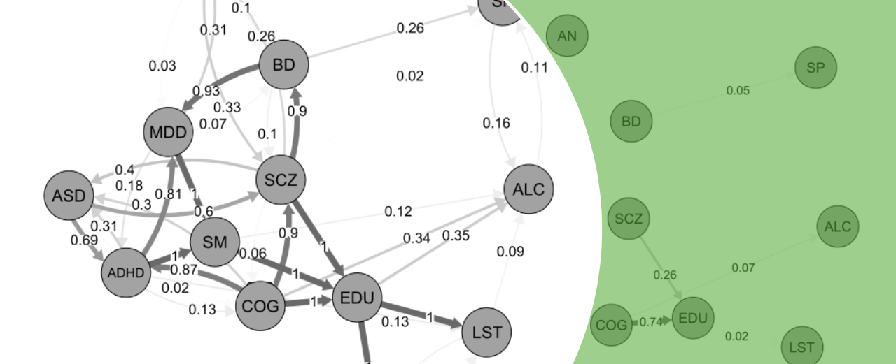

# MrDAG: Bayesian causal graphical model for joint Mendelian randomization analysis of multiple exposures and outcomes

This R-package (version: **0.1.1**) introduces the **MrDAG** model ([Zuber et al., 2025](https://doi.org/10.1016/j.ajhg.2025.03.005)), a Bayesian two-sample summary-level Mendelian randomization (MR) method which explicitly models dependency relations within the exposures, the outcomes and between them to improve the estimation of causal effects. In MrDAG the directionality of the causal effects between the exposures and the outcomes is assumed known, i.e., the exposures can only be potential causes of the outcomes and no reverse causation is allowed.

The development of **MrDAG** was motivated to uncover complex and sometimes reciprocal relationships among lifestyle and behavioural exposures that impact mental health phenotypes.

**MrDAG** combines three causal inference strategies:
<ul>
    <li> First, it uses genetic variation as instrumental variables to account for unmeasured confounders;
    <li> Second, it performs structure learning to detect and orientate the direction of the dependencies within exposures and outcomes; 
    <li> Third, interventional calculus is employed to derive causal effect estimates.
</ul>

The implementation of **MrDAG** is fully Bayesian. It allows us to model the uncertainty regarding which graphical models, under the constraint of edges' orientation from the exposures to the outcomes, best describe the underlying dependency structure in a given data set. Then, it employs this uncertainty for the estimation of the causal effects.

**MrDAG** returns Directed Acyclic Graphs (DAGs) that belong to the Markov Equivalent Classes whose unique representative chain graphs are the Essential Graphs, the posterior probability of edge inclusion (PPEI) between two traits (nodes) and the Bayesian model-averaged causal effects under intervention on the exposures.

Two data sets are included in the R-package:
<ul>
    <li> The first data set (LBT2MD_data) contains lifestyle and behavioural traits that are considered exposures of the risk of mental health phenotypes. As outcomes, seven mental health phenotypes are considered, including (in alphabetic order) attention deficit hyperactivity disorder (ADHD), anorexia nervosa (AN), autism spectrum disorder (ASD), bipolar disorder (BD), cognition (COG),  major depressive disorder (MDD) and schizophrenia (SCZ). As exposures, six lifestyle and behavioural traits that have previously been investigated for their protective/risk effects on mental health are considered, including (in alphabetic order) alcohol consumption (ALC), education (in years) (EDU), leisure screen time (LST), physical activity (PA), lifetime smoking index (SM) and sleep duration (SP). 708 independent Instrumental Variables (IVs) are selected to be associated at genome-wide significance with the exposures after clumping;
    <li> The second data set (MD2LBT_data) reverses the definition of exposures (mental health phenotypes) and outcomes (lifestyle and behavioural traits) to perform reverse causation analysis. It consists of 470 independent IVs selected to be associated at genome-wide significance with the exposures after clumping.
</ul>

## Installation

The installation of **MrDAG** requires the following steps:

1.  Install the [**devtools**](https://github.com/r-lib/devtools)
    package. This can be done from
    [**CRAN**](https://cran.r-project.org/). Invoke R and then type
    
    ``` 
     install.packages("devtools")
    ```

2.  Load the **devtools** package
    
    ``` 
     library("devtools")
    ```

3.  Install **MrDAG** package by typing
    
    ``` 
     devtools::install_github("lb664/MrDAG")
    ```

4.  Finally, load the **MrDAG** package
    
    ``` 
     library("MrDAG")
    ```

## Example 1

The first example concerns the analysis of lifestyle and behavioural exposures that might impact mental health phenotypes. After loading the data set (IVW summary-level statistics)

<!---
# 80 characters ###############################################################
-->

    data(LBT2MD_data)

the indices of the traits that define the outcomes and exposures are provided 
in a list object

    MrDAGcheck <- NULL
    MrDAGcheck$Y_idx <- 1 : 7    # Mental health phenotypes
    MrDAGcheck$X_idx <- 8 : 13   # Lifestyle and behavioural traits

and **MrDAG** algorithm is run to generate 1,000 posterior samples of all unknowns

    output <- MrDAG(data = LBT2MD_data, 
                    niter = 7500, burnin = 2500, thin = 5, 
                    tempMax = 20, pp = 0.01, 
                    MrDAGcheck = MrDAGcheck, fileName = NULL)

with 0.01 prior probability of edge inclusion. Finally, the posterior probabilities of edge inclusion (PPEIs) are calculated and presented in a data matrix with lifestyle and behavioural traits first, followed by mental health phenotypes

    ord <- c(8 : 13, 1 : 7)
    PPEI <- get_edgeprob(output, ord = ord)

**Warning!** In Example 1, the number of iterations is set at 7,500 of which with 2,500 as burn-in (overall, 1,000 samples saved as draws from the posterior distribution). However, to obtain reliable results in real data applications and analysis, the number of iterations should be much larger. We recommend running the algorithm at least for 110K iterations of which 10K as burn-in.

## Example 2

This second example performs the analysis of the same data set for reverse causation to explore whether mental health phenotypes might affect lifestyle and behavioural traits. After loading the data set (IVW summary-level statistics)

<!---
# 80 characters ###############################################################
-->

    data(MD2LBT_data)

the indices of the traits that define the outcomes and exposures are provided in a list object

    MrDAGcheck <- NULL
    MrDAGcheck$Y_idx <- 1 : 6    # Lifestyle and behavioural traits
    MrDAGcheck$X_idx <- 7 : 13   # Mental health phenotypes

and **MrDAG** algorithm is run to generate 1,000 posterior samples of all unknowns

    output <- MrDAG(data = MD2LBT_data, 
                    niter = 15000, burnin = 5000, thin = 10, 
                    tempMax = 20, pp = 0.01, 
                    MrDAGcheck = MrDAGcheck, fileName = NULL)

with 0.01 prior probability of edge inclusion. Finally, the (average) causal effects and 90% credible intervals are estimated

    causalEffects <- get_causaleffects(output, CI = 0.90, progress = TRUE)

showing on the screen the progress of the causal effects estimation.

**Warning!** In Example 2, the number of iterations is set at 15,000 of which with 5,000 as burn-in (overall, 1,000 samples saved as draws from the posterior distribution). However, to obtain reliable results in real data applications and analysis, the number of iterations should be much larger. We recommend running the algorithm at least for 110K iterations of which 10K as burn-in.

## News/changelog

For a version history/changelog, please see [Changelog](https://github.com/lb664/MrDAG/blob/main/CHANGELOG.md)

## Issues

To report an issue, please use the **MrDAG** issue tracker at [BugReports](https://github.com/lb664/MrDAG/issues)

This software uses the GPL v2 license, see [License](https://github.com/lb664/MrDAG/blob/main/LICENSE). Authors and copyright are provided in [Description](https://github.com/lb664/MrDAG/blob/main/DESCRIPTION)
